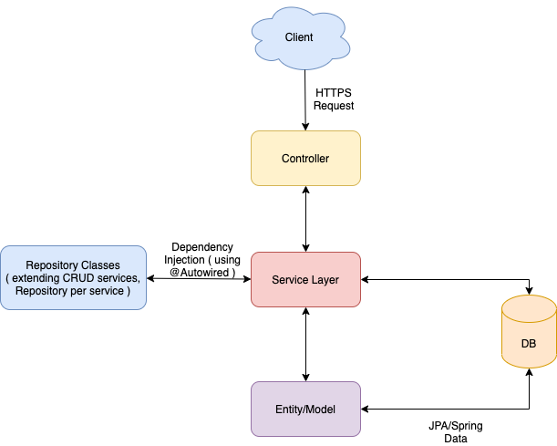
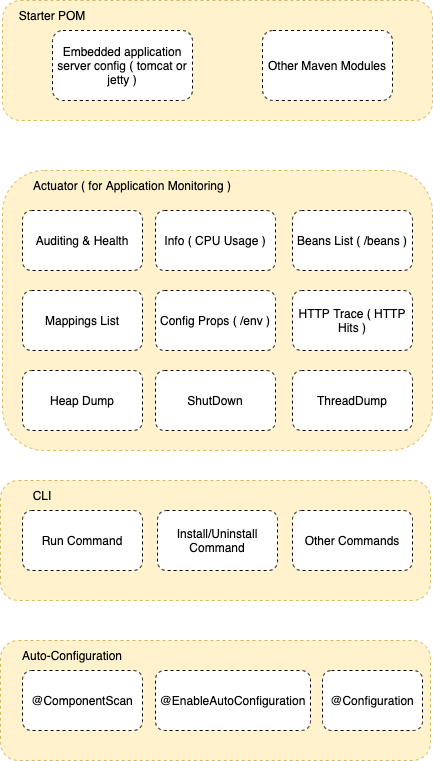
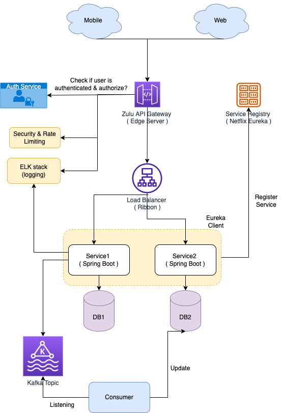

# What is Spring boot?
- Sprint boot is a Java-based spring framework used for Rapid Application Development (to build stand-alone microservices). 
- It has an extra support of autoconfiguration and *embedded application server like tomcat*, jetty, etc.



# Spring vs Spring Boot

[Spring](https://spring.io/) is an open-source lightweight framework that allows Java EE 7 developers to build simple, reliable, and scalable enterprise applications. This framework mainly focuses on providing various ways to help you manage your business objects. It made the development of Web applications much easier than compared to classic Java frameworks and Application Programming Interfaces (APIs), such as Java database connectivity (JDBC), JavaServer Pages(JSP), and Java Servlet. This framework uses various new techniques such as Aspect-Oriented Programming (AOP), Plain Old Java Object (POJO), and dependency injection (DI), to develop enterprise applications.

[Spring Boot](https://spring.io/projects/spring-boot) is built on top of the conventional spring framework.
- So, it provides all the features of spring and is yet easier to use than spring.
- Spring Boot is a microservice-based framework and making a production-ready application in very less time.
- In Spring Boot everything is auto-configured.
- We just need to use proper configuration for utilizing a particular functionality.
- Spring Boot is very useful if we want to develop REST API.
- [Read More](https://www.geeksforgeeks.org/difference-between-spring-and-spring-boot/)

# What are the advantages of using Spring Boot?
- Easy to understand and develop spring applications.
- Spring Boot is nothing but an existing framework with the addition of an embedded HTTP server and annotation configuration which makes it easier to understand and faster the process of development.
- Increases productivity and reduces development time.
- Minimum configuration.
- We don’t need to write any XML configuration, only a few annotations are required to do the configuration.



# What are the Spring Boot key components?
- Spring Boot auto-configuration.
- Spring Boot CLI.
- Spring Boot starter POMs.
- Spring Boot Actuators.

# Why Spring Boot over Spring?
- Starter POM.
- Version Management.
- Auto Configuration.
- Component Scanning.
- Embedded server.
- InMemory DB.
- Actuators

# What is repository?
- We should create a repository per service if that makes any sense.

# How does Spring Boot work?
- Spring Boot automatically configures your application based on the dependencies you have added to the project `by using annotations`. 
- The entry point of the spring boot application is the class that contains `@SpringBootApplication` annotation and the main method.
- Spring Boot automatically scans all the components included in the project by using `@ComponentScan` annotation.

# Different Annotations

| Annotation                                                                                        | Remarks                                                                                                                                                                                                            |
|---------------------------------------------------------------------------------------------------|--------------------------------------------------------------------------------------------------------------------------------------------------------------------------------------------------------------------|
| @SpringBootApplication                                                                            | -                                                                                                                                                                                                                  |
| @EnableAutoConfiguration                                                                          | @EnableAutoConfiguration annotation enables the auto-configuration of Spring ApplicationContext by scanning the classpath components and registering the beans.                                                    |
| @ComponentScan                                                                                    | Spring Boot automatically scans all the components included in the project by using `@ComponentScan` annotation.                                                                                                   |
| @Configuration                                                                                    | -                                                                                                                                                                                                                  |
| @RestController                                                                                   | RestController is used for making restful web services with the help of the @RestController annotation. This annotation is used at the class level and allows the class to handle the requests made by the client. |
| @RequestMapping(value = "/activate",  method = RequestMethod.POST, produces = "application/json") | -                                                                                                                                                                                                                  |
| @PostMapping("/store")                                                                            | Post mapping annotation on the method                                                                                                                                                                              |
| @GetMapping("/store")                                                                             | Get mapping annotation on the method                                                                                                                                                                               |
| X(@RequestBody MeterReadings meterReadings)                                                       | HTTP Post body of the API                                                                                                                                                                                          |
| Y(@PathVariable String smartMeterId)                                                              | URL Parameter in the API                                                                                                                                                                                           |
| @Bean                                                                                             | @Bean is a method-level annotation. @Bean annotation specifies that a method produces a return value registered as a bean ( data ) with BeanFactory – managed by Spring Container.                                 |
| @Primary                                                                                          | -                                                                                                                                                                                                                  |
| @Entity                                                                                           | To annotate the database object                                                                                                                                                                                    |

# How to disable a specific auto-configuration class?
You can use exclude attribute of `@EnableAutoConfiguration` if you want auto configuration not to apply to any specific class.

```java
//use of exclude
@EnableAutoConfiguration(exclude={className});
```

# Most commonly used Spring Boot CLI commands?

```script
spring --help
-run, -test, -grap, -jar, -war, -install, -uninstall, --init, -shell, -help.
```

# What is the default port of tomcat in spring boot?
- The default port of the tomcat server-id 8080. 
- It can be changed by adding `sever.port` properties in the `application.properties` file.

# Can we override or replace the Embedded tomcat server in Spring Boot?
- Yes, we can replace the Embedded Tomcat server with any server by using the Starter dependency in the `pom.xml` file. 
- Like you can use `spring-boot-starter-jetty` as a dependency for using a jetty server in your project.

# How to enable Actuator in Spring boot application?

```xml
<dependency>
    <groupId> org.springframework.boot</groupId>
    <artifactId> spring-boot-starter-actuator </artifactId>
</dependency>
```

# What is the starter dependency of the Spring boot module?
- Data JPA starter.
- Test Starter.
- Security starter.
- Web starter.
- Mail starter.
- Thymeleaf starter.

# Min. Java Version needed for Spring Boot
- Java 8

# What dependency needed to create a Spring Boot web application?
- Spring Boot Starter Web

# Configure the Logging Levels

You can easily tune the [logging levels](https://www.baeldung.com/spring-boot-application-configuration) in a Boot application.
- And just as with a standard Spring app – you can activate different logging systems like Logback, log4j, log4j2, etc. by adding their customized XML or properties file in the classpath and defining the libraries in the pom.

```config
logging.level.org.springframework.web: DEBUG
logging.level.org.hibernate: ERROR
```

# Microservices - How to develop, deploy microservices using Spring Boot?



## Components
- [Zulu API Gateway](https://github.com/Anshul619/HLD-System-Designs/tree/main/3_MicroServices/1_APIGateway/ZuluAPIGateway.md)
- [Eureka Server for Service Registry and discovery](https://github.com/Anshul619/HLD-System-Designs/tree/main/3_MicroServices/2_ServiceRegistry%26Discovery/Eureka.md)

# References
- https://www.javatpoint.com/microservices
- https://www.interviewbit.com/spring-boot-interview-questions/
- https://java2blog.com/spring-restcontroller-example/
- https://res.cloudinary.com/deop9ytsv/image/upload/v1545143589/1_Z8HUa8vdvIrF68crSJOPTQ.png
- https://1nwu8i3sj55rdbw4k4fm55i1-wpengine.netdna-ssl.com/wp-content/uploads/2015/09/MSArchitech.png
- https://res.cloudinary.com/practicaldev/image/fetch/s--DXg7gK9m--/c_limit%2Cf_auto%2Cfl_progressive%2Cq_auto%2Cw_880/https://cdn-images-1.medium.com/max/2000/1*b4krMVZ-mqjxAIh_EM1jhQ.png
- https://stackoverflow.com/questions/6887971/single-or-multiple-repository-classes
- [SUPERSONIC/ SUBATOMIC/ JAVA](https://quarkus.io/)